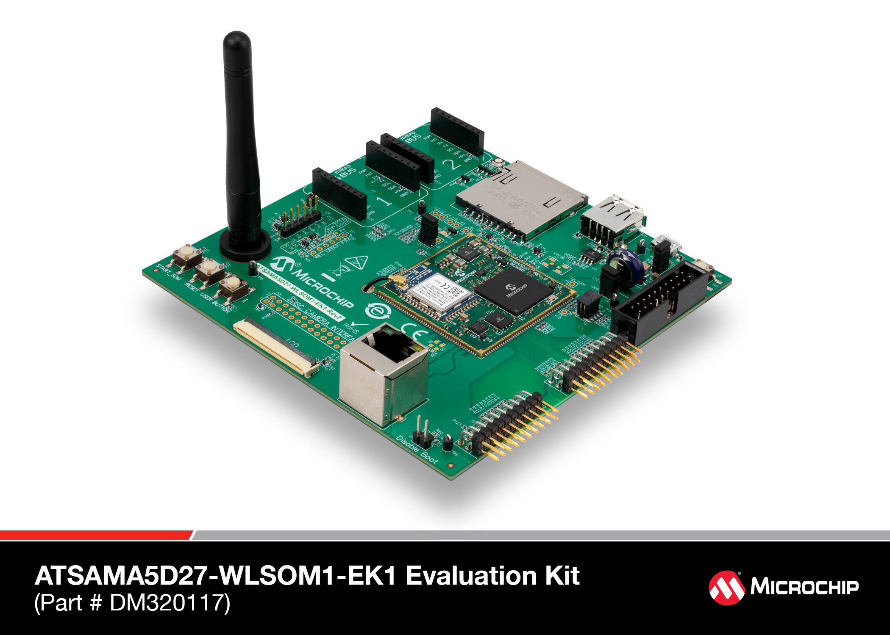

# ATSAMA5D27-WLSOM1 Evaluation Kit

https://www.microchip.com/DevelopmentTools/ProductDetails/PartNO/DM320117

 [Image credit](#microchip)

| Feature              | Description                     |
| -------------------- | ------------------------------- |
| CPU                  | 500 MHz ARM Cortex-A5           |
| Memory               | 256M DDR2                       |
| Storage              | MicroSD                         |
| GPIO, I2C, SPI       | Yes - [Elixir Circuits](https://github.com/elixir-circuits) |
| UART                 | ttyS0                           |
| Ethernet             | Yes                             |
| Video                | Yes                             |
| Camera Interface     | Yes - Parallel ISC              |
